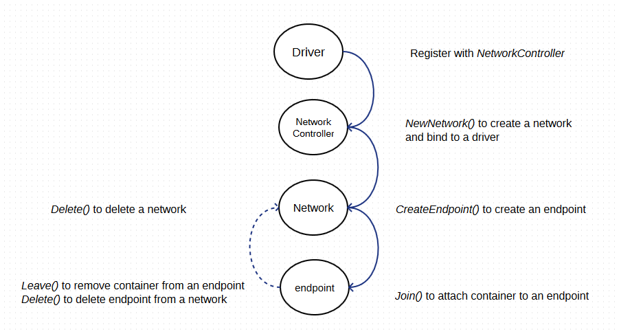

## controllers.py
作为 libnetwork 的一个 remote 类型驱动的代理（基于 flask 框架），定义响应 REST 请求的一系列入口函数。按照 [https://github.com/docker/libnetwork/blob/master/docs/remote.md](https://github.com/docker/libnetwork/blob/master/docs/remote.md) 中定义的请求和响应消息来实现。

主要包括：network_driver_create_endpoint、network_driver_create_network、network_driver_delete_endpoint、network_driver_delete_network、network_driver_discover_delete、network_driver_discover_new、network_driver_endpoint_operational_info、network_driver_join、network_driver_leave、plugin_activate、plugin_scope等。

CNM 中定义的整个生命周期如下图所示。

### plugin_activate
响应 POST 到 /Plugin.Activate，回复实现的驱动的类型列表。

### plugin_scope
响应 POST 到 /NetworkDriver.GetCapabilities，回复驱动的范围：local 或者 global。

### network_driver_create_network
响应 POST 到 /NetworkDriver.CreateNetwork。

根据给定的 libnetwork 中的 network id 作为名字来创建一个新的 Neutron 网络。

### network_driver_create_endpoint
响应 POST 到 /NetworkDriver.CreateEndpoint。

根据给定的 endpoint 来创建一个新的 Neutron 子网和接口。

### network_driver_join
响应 POST 到 /NetworkDriver.Join。

绑定一个 Neutron 接口到一个容器的接口。

### network_driver_leave
响应 POST 到 /NetworkDriver.Leave。

解除绑定一个 Neutron 接口到一个容器的接口。

### network_driver_delete_endpoint
响应 POST 到 /NetworkDriver.DeleteEndpoint。

根据给定的 endpoint 来删除对应的 Neutron 子网和接口。

### network_driver_delete_network
响应 POST 到 /NetworkDriver.DeleteNetwork。

根据给定的 libnetwork 的 network id 作为名字来删除对应的 Neutron 网络。

### network_driver_discover_delete
响应 POST 到 /NetworkDriver.DeleteNetwork。

### network_driver_discover_new
响应 POST 到 /NetworkDriver.DiscoverNew。

### network_driver_endpoint_operational_info
响应 POST 到 /NetworkDriver.EndpointOperInfo。

回复某个 endpoint 上的可操作信息。